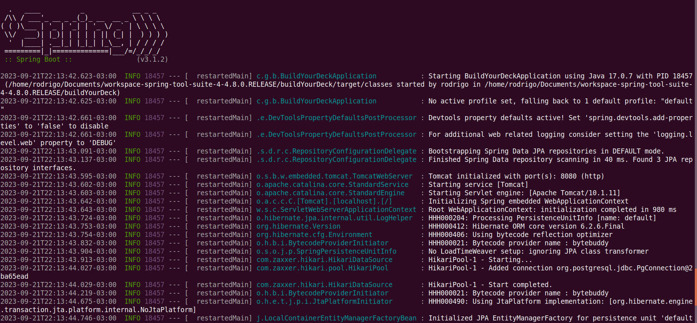

# Build Your Deck  Back-End


## Sobre

API(Application Programming Interface) Que fornece todo o controle de login e criação de Decks de Yugioh. Com esse serviço é possível criar um perfil e montar varios decks.


## Requisitos de software 

  


## Procedimentos de execução sem docker


Clone o projeto

Via ssh

```bash
git clone https://github.com/RodrigoGuedelho/build-yugioh-deck.git
```


Com o projeto clonado, acesse o diretório e instale todas as dependências necessárias

```bash
cd cloudplus_dashboard_back
mvn clean install 
```


Inicie a aplicação

```bash
./mvnw spring-boot:run
```





### Procedimentos de execução com docker


Para gerar o build da aplicação: 

```bash
mvn clean install
```


Após o build, para iniciar o contâiner, execute:

```bash
docker-compose build 
```


Para iniciar o contâiner em modo background, execute:

```
docker-compose up -d 
```
